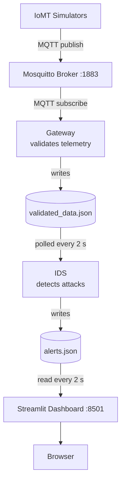

# 🏥 Secure IoMT Platform

> Real-time cybersecurity supervision for the Internet of Medical Things (IoMT): detect **Data Injection**, **Device Spoofing** and **Denial of Service** attacks on medical device telemetry.


<!-- Add a screenshot or GIF of the dashboard here, e.g. docs/dashboard.png -->
<!--  -->

## Table of Contents

- [Features](#features)
- [Architecture](#architecture)
- [Prerequisites](#prerequisites)
- [Quick Start](#quick-start)
- [Attack Simulations](#attack-simulations)
- [Viewing Logs](#viewing-logs)
- [Reset & Cleanup](#reset--cleanup)
- [Project Structure](#project-structure)
- [Troubleshooting](#troubleshooting)
- [Disclaimer](#disclaimer)

---

## Features

- **Simulated medical devices** publishing telemetry over MQTT (4 active devices)
- **Gateway** that validates incoming telemetry before it is stored
- **Intrusion Detection System (IDS)** detecting three attack types in real time
- **Streamlit dashboard** (auto-refresh every 2 s) showing devices, alerts and system metrics (CPU, memory)
- **Optional LLM incident analysis** via [Ollama](https://ollama.com)
- **Ready-to-run attack scripts** for reproducible demos

### Detected attacks

| Attack | Scenario | Expected alert | Severity |
|---|---|---|---|
| Data Injection | `HRM001` sends an invalid heart rate | `Data Injection` | High |
| Device Spoofing | Unknown device ID `UNKNOWN999` | `Device Spoofing` | Medium |
| Denial of Service | 1000 rapid messages | `DoS` (high anomaly score) | — |

---

## Architecture



---

## Prerequisites

| Tool | Notes |
|---|---|
| [Docker](https://docs.docker.com/get-docker/) + Docker Compose v2 | Required, runs the whole stack |
| Git | To clone the repository |
| `jq` | Optional, for pretty-printing alerts |
| [Ollama](https://ollama.com) | Optional, for LLM incident analysis |
| Python 3.10+ | Only needed for local development outside Docker |

---

## Quick Start

### 1. Clone the repository

```bash
git clone https://github.com/your-org/secure-iomt-platform.git
cd secure-iomt-platform
```

### 2. Start the stack

```bash
docker compose up -d --build
```

Check that everything is running:

```bash
docker compose ps
```

You should see **6 services**: `mosquitto`, `gateway`, `ids`, `dashboard`, `normal-simulator`, `multi-simulator`.

### 3. Open the dashboard

👉 **http://localhost:8501**

The dashboard shows connected devices, live security alerts, system metrics and (optionally) LLM incident analysis.

### 4. (Optional) Local development setup

Only needed if you want to run or edit the Python code outside Docker.

```bash
# Linux / macOS / WSL
python3 -m venv venv
source venv/bin/activate

# Windows PowerShell
python -m venv venv
.\venv\Scripts\Activate.ps1

pip install -r requirements.txt
```

Leave the environment with `deactivate`.

---

## Attack Simulations

With the stack running, launch an attack from a second terminal and watch the **Security Alerts** table in the dashboard.

### Data Injection

`HRM001` sends an invalid heart rate value.

```bash
docker compose run --rm attack-data-injection
```

✅ Expected: `Data Injection` alert, severity **High**.

### Device Spoofing

A device with an unknown ID (`UNKNOWN999`) publishes telemetry.

```bash
docker compose run --rm attack-device-spoofing
```

✅ Expected: `Device Spoofing` alert, severity **Medium**.

### Denial of Service

1000 messages are sent in rapid succession.

```bash
docker compose run --rm attack-dos
```

✅ Expected: `DoS` alert with a high anomaly score.

### Inspect raw alerts

```bash
jq . data/alerts.json
```

---

## Viewing Logs

```bash
docker logs -f secureiomt-gateway           # MQTT subscriber / validator
docker logs -f secureiomt-ids               # attack detection
docker logs -f secureiomt-dashboard         # web interface
docker logs -f secureiomt-normal-simulator  # normal traffic
docker logs -f secureiomt-multi-simulator   # multi-device traffic
```

---

## Reset & Cleanup

Stop the stack:

```bash
docker compose down
```

Reset all data files for a fresh demo:

```bash
# Linux / WSL
for f in data/validated_data.json data/alerts.json data/logs.json data/devices.json \
         gateway/data/validated_data.json gateway/data/logs.json; do
  sudo sh -c "printf '[]' > $f"
done
```

```powershell
# Windows PowerShell (run as administrator)
$files = "data/validated_data.json","data/alerts.json","data/logs.json","data/devices.json",
         "gateway/data/validated_data.json","gateway/data/logs.json"
foreach ($f in $files) { "[]" | Out-File -Encoding utf8 $f }
```

Then restart for a clean demo:

```bash
docker compose up -d --build
```

---

## Project Structure

```text
secure-iomt-platform/
├── dashboard/          # Streamlit web interface
├── gateway/            # MQTT subscriber & telemetry validator
├── ids/                # Intrusion detection system
├── simulator/          # Normal & attack simulators
├── data/               # Shared JSON data files
├── docker-compose.yml  # Container orchestration
├── requirements.txt    # Python dependencies
└── README.md
```

---

## Troubleshooting

| Problem | Fix |
|---|---|
| Dashboard not loading on `:8501` | Run `docker compose ps` and check that `dashboard` is `Up`; read its logs |
| Port `1883` or `8501` already in use | Stop the conflicting process or change the port mapping in `docker-compose.yml` |
| No alerts appear after an attack | Check `docker logs secureiomt-ids -f` and confirm `data/validated_data.json` is being filled |
| `Permission denied` on `data/*.json` | Use the `sudo` reset commands above, or fix ownership with `sudo chown -R $USER data gateway/data` |
| LLM analysis is empty | Make sure Ollama is running and reachable from the dashboard container |

---

## Disclaimer

This project is a **research / educational demo** that uses simulated devices and simulated attacks. Do not connect it to real medical equipment or run the attack scripts against systems you do not own or have permission to test.

<!-- Optional: add a License section (e.g. MIT), authors / contributors, and a roadmap. -->
